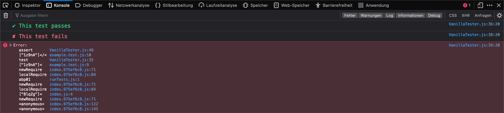

# Vanilla Tester
Vanilla Tester is a very simple vanilla JavaScript plugin for writing unit
tests. It allows you to create separate files for the tests. It also shows you
the results in the console and not in the terminal.

## Demo
To try out Vanilla Tester clone this repo and run the following commands.

First install npm packages
```bash
npm install
```
Then run

```bash
npm start

# output
> Vanilla Tester@1.0.0 start
> parcel index.html

Server running at http://localhost:1234
Built in 1.60s
```
Visit `http://localhost:1234` to see the result. Your port may not be `1234`!

## Why Not Use Frameworks Like Jest or Mocha
Two reasons, my personal reasons:

* First, some JS projects are very small and using testing frameworks seems just
    overkill. For small projects you can simply use `console.assert()`.

* Second reasons is that I personally never really liked working with
    frameworks. I wanted something that is simple, lightweight and maintainable,
    something that would show me the results right in the console and not force
    me to switch between browser, terminal and code editor.

I'm by no means trying to reinvent the wheel here. I'm merely trying to write
something that works for me so I can have the confidence to write my own code
and maintain it myself.

## Builtin JS Method for Unit Tests
There is a builtin JS method for asserting test cases. See the example below.
Let's suppose we want to test the `push()` method, the builtin array method. We
want to test if it pushes a given array item into our array.

```javascript
// Not the best test case but good enough to show how console.assert() works

const fruits = ['apples', 'oranges', 'bananas'];
fruits.push('grapes');

// This assertion fails - you will see the message in the console.
console.assert(fruits.includes('grapses'), 'Push Method. Should add grapes to fruits array!');

// This assertion passes - you will NOT see the message in the console.
console.assert(fruits.includes('grapes'), 'Push Method. Should add grapes to fruits array!');
```

This is very rudimentary. It only shows you an error message in the console if an
assertion fails if a test passes however you don't see anything. I wanted a
script that will show me in the console which tests are passing and which are
failing each time I run my tests.

Looking for solutions on the Interwebs I came across [this article](https://javascript.plainenglish.io/unit-test-front-end-javascript-code-without-a-framework-8f00c63eb7d4). You should read it to understand whats
going on. The testing code is the same I simply turned it into a plugin so I can
use it as a module which will allow me to create separate files for different
test case.

# How to Use Vanilla Tester
First you need to get the plugin file `VanillaTester.js`. Copy it to your JS
directory. You can create a directory called `plugins/` in your JS directory and
put the `VanillaTester.js` file there.

In your test files you want to instantiate the object as shown in the example below:

```javascript
import VanillaTester from '../plugins/VanillaTester';

const tester = new VanillaTester();
```

The `VanillaTester` object takes an object as an argument which allows you to
customize the Vanilla Tester a little. See the object below to see all the
attributes you can customize.

```javascript
const tester = new VanillaTester({
    commonStyles: [
        'font-size: 1.4rem;',       // Font size
        'line-height: 1.5;'         // line height
    ],
    colorPass: [
        'color: #33d275;'           // Color for passing tests
    ],
    colorFail: [
        'color: #ff6b79;'           // Color for failing tests
    ],
    iconPass: '\u2714',             // Icon for passing tests
    iconFail: '\u2718'              // Icon for failing tests
});
```

These are just some CSS styles you can use to style the test results in the
console. You can use more properties but not all. Following is a list of CSS
properties you're allowed to use.

<table>
<tr>
<th> Chrome/Chromium </th>
<th> Firefox </th>
</tr>
<tr>
<td>
Chrome allows CSS properties with any of the<br/>
following PREFIXES [Reference](https://github.com/ChromeDevTools/devtools-frontend/blob/5165a7a61b1d10354d560dc72dc6409bf21ea5ae/front_end/console/ConsoleViewMessage.js#L895-L907)

* `font`
* `line`
* `text`
* `color`
* `border`
* `margin`
* `padding`
* `background`
* `-webkit-font`
* `-webkit-text`
* `-webkit-border`
* `-webkit-margin`
* `-webkit-padding`
* `-webkit-background`
</td>
<td>
Firefox allows the following properties [Reference](https://developer.mozilla.org/en-US/docs/Web/API/Console#styling_console_output)
* `color`
* `cursor`
* `margin`
* `padding`
* `display`
* `box-shadow`
* `white-space`
* `writing-mode`
* `border-radius`
* `line-height`
* `clear` and `float`
* `box-decoration-break`
* `word-spacing` and `word-break`
* `background` and its longhand equivalents
* `border` and its longhand equivalents
* `font` and its longhand equivalents
* `outline` and its longhand equivalents
* `text-*` properties such as `text-transform`
</td>
</tr>
</table>

If you're further interested in Console API read [this](https://developer.chrome.com/docs/devtools/console/api/#styling_console_output_with_css). The best part you can even show a table
in the console which you can use for modifying test results. Read about it
[here](https://developer.chrome.com/docs/devtools/console/api/#table).

## Tester Files
### HTML File
You can run your tests in `index.html` but if you want to run them in a separate
file then you can create a separate HTML file. You can either name it
`test.html` or `vanillaTester.html` or whatever name you like.

### JavaScript Files
I mostly use Webpack and Parcel so my file tree looks like following:

```
.
├── assets
│   └── se_logo.svg
├── index.js
├── js
│   ├── plugins
│   └── tests
└── sass
    ├── abstracts
    ├── base
    ├── components
    ├── layout
    ├── main.scss
    ├── pages
    └── themes
```

**I take following steps to structure my tests:**
* Inside `js/` directory I create a directory called `tests/` where I
    put all my tests. I use Jest file naming convention:
    `<testFileName>.test.js`.

* Among test files I also create a file called `runTests.js` where I import
    all the tests as you can see below.
    ```javascript
    import './example.test.js';
    import './todo.test.js';
    import './modal.test.js';
    import './ajaxios.test.js';
    ```

* Lastly I import `runTests.js` file inside my `main.js` file.

## Let's Now Write Some Tests

### Your First Test
Let's first test our plugin if it works, if it returns anything to the console
when we run a test.

```javascript
import VanillaTester from '../plugins/VanillaTester';

const tester = new VanillaTester();

// A passing test
tester.test('This test passes', () => {
    tester.assert(1 === 1);
});

// A failing test
tester.test('This test fails', () => {
    tester.assert(1 !== 1);
})
```

**Both tests will log the following messages to the console.**



### Testing the DOM

To use a separate tester file (I'll name mine `vanillaTester.html`) we can use
the HTML below.
```html
<!DOCTYPE html>
<html lang="en">
<head></head>
<body>
    <main class="main">
        <section class="vanilla-tester test">
            <div class="container">
                <div class="test__container"></div>
            </div>
        </section>
    </main>
</body>
</html>
```

#### Test Case 1
We want to test a form with one input field. It should add a given value to an
unordered list as a list item a sort of todo list.

```javascript
tester.test('Add an item to the list', () => {
    // Select the test container
    const parentElem = document.querySelector('.test__container');
    
    // Set the innerHTML for test container
    parentElem.innerHTML = `
        <form class="todo__form">
            <input type="text" name="todo__input">
            <button type="submit">Submit</button>
        </form>
        <ul class="todo__list"></ul>
    `;

    // Select the form
    const form = document.querySelector('.todo__form');

    // The value we want to test
    form.elements['todo__input'].value = 'Task One';

    // Create a custom event which will automatically submit the form
    const event = new Event('submit', {bubbles: true, cancelable: true});
    event.preventDefault();
    form.addEventListener('submit', function() {
        const todoList = document.querySelector('.todo__list');
        todoList.innerHTML = `<li>${form.elements['todo__input'].value}</li>`
    });
    form.dispatchEvent(event);

    // Assertion
    tester.assert(parentElem.innerHTML.toLowerCase().includes('<li>task one</li>'));

    // Clear the parent element i.e the test container
    parentElem.innerHTML = '';
});
```

#### Test Case 2.1
Testing a modal. Before I write any functionality I'll write only the HTML and
try to run a test to see how the implementation would look like.

##### HTML Code
```html
<!-- Modal Triggers -->
<div class="modal__triggers">
    <a class="btn btn--default btn--round" href="#" data-modal-trigger="modal-one">Modal One</a>
    <a class="btn btn--default" href="#" data-modal-trigger="modal-two">Modal Two</a>
</div>

<!-- Modal One -->
<div class="modal__container" data-modal-id="modal-one">
    <div class="modal__backdrop"></div>
    <div class="modal__content">
        <div class="modal__head">
            <h3 class="heading-light heading-3">Modal One</h3>
        </div>
        <div class="modal__body">
            <h3 class="heading-light heading-3">This is the modal body!</h3>
        </div>
        <div class="modal__foot">
            <a class="btn btn--default" href="#" data-modal-close="modal-one">Close</a>
            <a class="btn btn--default" href="#" data-modal-trigger="modal-two">Modal Two</a>
        </div>
    </div>
</div>

<!-- Modal Two -->
<div class="modal__container" data-modal-id="modal-two">
    <div class="modal__backdrop"></div>
    <div class="modal__content">
        <div class="modal__head">
            <h3 class="heading-light heading-3">Modal Two</h3>
        </div>
        <div class="modal__body">
            <h3 class="heading-light heading-3">This is the modal body!</h3>
        </div>
        <div class="modal__foot">
            <a class="btn btn--default" href="#" data-modal-close="modal-two">Close</a>
        </div>
    </div>
</div>
```

##### Test File `modal.test.js`
```javascript
tester.test('Test if all the modals on the page can open and close!', () => {
    // Select all the triggers and closers
    const triggers = document.querySelectorAll('[data-modal-trigger]');
    const closers = document.querySelectorAll('[data-modal-close]');

    // Create a custom event which will automatically trigger the triggers
    const event = new Event('click', {bubbles: true, cancelable: true});
    event.preventDefault();

    // Loop through the triggers
    triggers.forEach((trigger) => {
        trigger.addEventListener('click', (e) => {

            // Extract the modal ID from data attribute
            const modalId = e.target.getAttribute('data-modal-trigger');
            
            // Get the right modal
            const modal = document.querySelector(`[data-modal-id=${modalId}]`);

            // Add the CSS class "show-modal" to open the modal
            modal.classList.add('show-modal');

            // Assert if the CSS class "show-modal" is actually added
            tester.assert([...modal.classList].includes('show-modal'));

            // Remove the CSS class to close the modal
            modal.classList.remove('show-modal');

            // For visual testing. Allows you to see the modal stay open for 3 sec
            // setTimeout(() => {
            //     modal.classList.remove('show-modal');
            // }, 3000);

        });
        trigger.dispatchEvent(event);
    });
});
```

#### Test Case 2.2
For the modal functionality I've written a plugin called [Sassy Modal](https://github.com/sassyelements/sassymodal).
Let's test if the HTML we've written for our modals would work with the plugin.
The Sassy Modal plugin is very straight forward. You import it, instantiate the
object and that's it. However our test will look different.
```javascript
tester.test('SassyModal. Test if openModal() and closeModal() methods work!', () => {
    // Instantiate the SassyModal object
    const modal = new SassyModal();

    let targetModal;

    // Open the given modal which is modal one
    modal.openModal({ modalID: 'modal-one' });
    // Select the opened modal
    targetModal = document.querySelector(`[data-modal-id=modal-one]`);
    // Assert if the CSS class "show-modal" is added to the target modal
    tester.assert([...targetModal.classList].includes('show-modal'));
    // Close the modal
    modal.closeModal({ modalID: 'modal-one' });

    // The same steps for modal two
    modal.openModal({ modalID: 'modal-two' });
    targetModal = document.querySelector(`[data-modal-id=modal-two]`);
    tester.assert([...targetModal.classList].includes('show-modal'));
    modal.closeModal({ modalID: 'modal-two' });
});
```

### Testing Asynchronous JavaScript
#### Test Case
I want to be able to write a function which will fetch data from a REST API and
return it in JSON format. For that I've written a little mock plugin. It's just
for this test case. It doesn't do much only fetches data from a REST API. The
plugin is called `src/js/plugins/Ajaxios.js`.

##### Test File `ajaxios.test.js`

```javascript
// Make the AJAX call
ajaxios.get('https://restcountries.com/v2/name/germany')
    .then((data) => {

        // Start the test. Because of our limited test plugin we have to run the
        // tests inside the then() method
        tester.test('Ajaxios. Should fetch data from Rest API', () => {
            tester.assert(data[0].name.toLowerCase() == 'germany');
            tester.assert(data[0].alpha2Code == "DE");
            tester.assert(data[0].alpha3Code == "DEU");
            tester.assert(data[0].borders.includes('AUT', 'BEL', 'CZE'));
        });

    });
```
